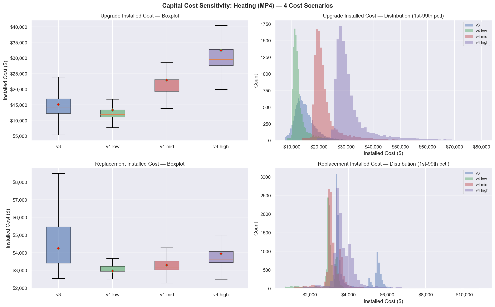

# Capital Cost Sensitivity Analysis: REMDB v3 vs v4

**Date:** February 10, 2026  
**Notebook:** `tare_scenarios_v2_2.ipynb`  
**Measure Package:** MP4 (Advanced Retrofit)  
**Sample Size:** 15,651 homes (12,266 valid for heating)  
**Cost Scenarios:** `v3`, `v4LOW`, `remdb_v4_mid`, `remdb_v4_high`

---

## 1. Overview

This report documents the results of a sensitivity analysis comparing heating capital cost estimates across four cost estimation methodologies:

| Scenario | Method | Description |
|----------|--------|-------------|
| `v3` | Probabilistic sampling | Excel-based cost dictionaries with stochastic sampling |
| `v4LOW` | Regression (25th pctl) | REMDB v4 regression model at 10th percentile |
| `remdb_v4_mid` | Regression (50th pctl) | REMDB v4 regression model at 50th percentile (median) |
| `remdb_v4_high` | Regression (75th pctl) | REMDB v4 regression model at 90th percentile |

The REMDB v4 regression formula is:
```
Material_Price = (pm1 * pm1_coef) + (pm2 * pm2_coef) + intercept
Installed_Cost = (Material_Price * multiplier) + adder
```

where coefficients vary by percentile (low/mid/high) and equipment type.

---

## 2. Test Results Summary

| Test | Description | Result |
|------|-------------|--------|
| **TEST 1** | Data Integrity | **8/8 PASS** |
| **TEST 2** | v4 Monotonicity (low ≤ mid ≤ high) | **1 PASS, 1 FAIL** |
| **TEST 3** | Cross-Scenario Comparison | Completed |
| **TEST 4** | Distribution Visualization | Completed |
| **TEST 5** | NPV Consistency | **PASS** |
| **TEST 6** | v4 Column Propagation | **PASS** |

---

## 3. TEST 1: Capital Cost Data Integrity

Checks that all cost columns exist, have reasonable NaN rates, no negative values, and positive means.

```
====================================================================================================
TEST 1: CAPITAL COST DATA INTEGRITY  (MP4, n=15,651 homes)
====================================================================================================
     PASS | v3        | upgrade      | valid=12,266 | NaN= 21.6% | neg=0 | mean=    15,086 | median=    14,229
     PASS | v3        | replacement  | valid=12,266 | NaN= 21.6% | neg=0 | mean=     4,235 | median=     3,524
     PASS | v4LOW    | upgrade      | valid=12,266 | NaN= 21.6% | neg=0 | mean=    13,284 | median=    11,889
     PASS | v4LOW    | replacement  | valid=12,266 | NaN= 21.6% | neg=0 | mean=     2,953 | median=     3,012
     PASS | remdb_v4_mid    | upgrade      | valid=12,266 | NaN= 21.6% | neg=0 | mean=    22,872 | median=    20,693
     PASS | remdb_v4_mid    | replacement  | valid=12,266 | NaN= 21.6% | neg=0 | mean=     3,291 | median=     3,133
     PASS | remdb_v4_high   | upgrade      | valid=12,266 | NaN= 21.6% | neg=0 | mean=    32,460 | median=    29,501
     PASS | remdb_v4_high   | replacement  | valid=12,266 | NaN= 21.6% | neg=0 | mean=     3,932 | median=     3,623

Summary: 8 PASS, 0 FAIL out of 8 checks
====================================================================================================
```

**Key findings:**
- All 4 scenarios produce identical valid counts (12,266) — the 21.6% NaN rate comes from housing type/occupancy filtering, not cost calculation failures
- No negative cost values in any scenario
- All means and medians are positive and in reasonable ranges

---

## 4. TEST 2: v4 Monotonicity (low ≤ mid ≤ high)

Verifies that for each home, the 10th percentile estimate ≤ 50th ≤ 75th.

```
====================================================================================================
TEST 2: v4 MONOTONICITY (low ≤ mid ≤ high for each home)
====================================================================================================
     PASS | upgrade      | n_valid=12,266 | low>mid=    0 | mid>high=    0 | low>high=    0
  !! FAIL | replacement  | n_valid=12,266 | low>mid=   64 | mid>high=    0 | low>high=    0
    Example violations:
         mp4_heating_replacement_installed_cost_low  ...  _mid       _high
bldg_id
7234                                        2329.87      2216.90    2540.69
32346                                       2348.32      2241.99    2583.68
56152                                       2371.52      2273.53    2637.71
57515                                       2516.87      2471.16    2976.28
87695                                       2376.26      2279.98    2648.76

Summary: 1 PASS, 1 FAIL out of 2 checks
====================================================================================================
```

**Key findings:**
- **Upgrade costs: PASS** — Perfect monotonicity across all 12,266 homes
- **Replacement costs: FAIL** — 64 homes (0.52%) where `low > mid`
  - Mid-to-high ordering is perfect (0 violations)
  - The violations are small in magnitude (~$100-$150)
  - This suggests the REMDB v4 regression coefficients for replacement equipment at certain capacity/fuel configurations produce slightly inverted results between the 25th and 50th percentiles
  - **Recommendation:** Investigate the affected regression coefficients in the REMDB v4 cost table for these specific equipment configurations

---

## 5. TEST 3: Cross-Scenario Comparison Table

### 5a. Summary Statistics

| Cost Type | Scenario | N Valid | Mean | Std | P5 | P25 | Median | P75 | P95 | Min | Max |
|-----------|----------|--------|------|-----|-----|-----|--------|-----|-----|-----|-----|
| Upgrade | v3 | 12,266 | $15,086 | $4,777 | $9,699 | $12,222 | $14,229 | $16,860 | $23,200 | $4,727 | $100,091 |
| Upgrade | v4LOW | 12,266 | $13,284 | $4,745 | $10,275 | $11,046 | $11,889 | $13,341 | $22,288 | $5,270 | $93,038 |
| Upgrade | remdb_v4_mid | 12,266 | $22,872 | $7,716 | $17,979 | $19,304 | $20,693 | $23,007 | $37,210 | $8,783 | $155,064 |
| Upgrade | remdb_v4_high | 12,266 | $32,460 | $10,692 | $25,678 | $27,563 | $29,501 | $32,706 | $52,107 | $12,297 | $217,089 |
| Replacement | v3 | 12,266 | $4,235 | $1,196 | $3,331 | $3,400 | $3,524 | $5,449 | $5,822 | $2,536 | $22,022 |
| Replacement | v4LOW | 12,266 | $2,953 | $711 | $1,287 | $2,933 | $3,012 | $3,224 | $3,523 | $346 | $15,567 |
| Replacement | remdb_v4_mid | 12,266 | $3,291 | $1,015 | $2,137 | $3,021 | $3,133 | $3,520 | $4,197 | $577 | $25,945 |
| Replacement | remdb_v4_high | 12,266 | $3,932 | $1,484 | $2,877 | $3,429 | $3,623 | $4,056 | $5,723 | $808 | $36,323 |

### 5b. v3 vs v4_mid Pairwise Comparison

**UPGRADE** (n=12,266 homes with both v3 & v4_mid):

| Metric | v3 | v4_mid |
|--------|-----|--------|
| Mean | $15,086 | $22,872 |
| Median | $14,229 | $20,693 |
| Difference (v4_mid − v3) — mean | +$7,787 | |
| Difference (v4_mid − v3) — median | +$6,411 | |
| Pct Difference — mean | +56.0% | |
| Pct Difference — median | +47.6% | |
| Ratio (v4_mid/v3) — mean | 1.56x | |
| Ratio (v4_mid/v3) — median | 1.48x | |
| Ratio — P5 | 1.11x | |
| Ratio — P95 | 2.28x | |

**REPLACEMENT** (n=12,266 homes with both v3 & v4_mid):

| Metric | v3 | v4_mid |
|--------|-----|--------|
| Mean | $4,235 | $3,291 |
| Median | $3,524 | $3,133 |
| Difference (v4_mid − v3) — mean | -$944 | |
| Difference (v4_mid − v3) — median | -$356 | |
| Pct Difference — mean | -20.0% | |
| Pct Difference — median | -10.6% | |
| Ratio (v4_mid/v3) — mean | 0.80x | |
| Ratio (v4_mid/v3) — median | 0.89x | |
| Ratio — P5 | 0.55x | |
| Ratio — P95 | 1.06x | |

---

## 6. TEST 4: Distribution Visualization



**Key observations from the plots:**

- **Upgrade costs (top row):**
  - v3 has the widest spread (probabilistic sampling produces higher variance)
  - v4 distributions are tighter/more deterministic — reflecting the regression-based methodology
  - v3 median ($14,229) falls between v4_low ($11,889) and v4_mid ($20,693)
  - v4_high ($29,501 median) is roughly 2x the v3 estimate

- **Replacement costs (bottom row):**
  - v3 has a distinctly different distribution shape — bimodal with a long right tail
  - v4 distributions are more concentrated, especially v4_low and v4_mid
  - v3 median ($3,524) is above v4_high ($3,623 mean but $3,623 median), with some overlap
  - The narrower v4 distributions suggest the regression captures less variability in replacement costs

---

## 7. TEST 5: Net Capital Cost & NPV Consistency

Validates that the NPV pipeline produces internally consistent results.

```
====================================================================================================
TEST 5: NET CAPITAL COST & PRIVATE NPV CONSISTENCY  (MP4)
====================================================================================================

--- noIRA (No Inflation Reduction Act) ---
  Checking columns (cost_scenario=remdb_v4_mid):
    MISSING | total_capital             | preIRA_mp4_heating_total_capital_cost_mid
    MISSING | net_capital               | preIRA_mp4_heating_net_capital_cost_mid
    FOUND | private_npv_lessWTP       | preIRA_mp4_heating_private_npv_lessWTP_fixed_base
           n=12,266  mean=$     -11,477  median=$     -15,625  min=$    -126,378  max=$      90,617
    FOUND | private_npv_moreWTP       | preIRA_mp4_heating_private_npv_moreWTP_fixed_base
           n=12,266  mean=$      -8,186  median=$     -12,534  min=$    -121,007  max=$      97,874
  moreWTP ≥ lessWTP check: PASS

--- IRA (AEO2023 Reference Case) ---
  Checking columns (cost_scenario=remdb_v4_mid):
    MISSING | total_capital             | iraRef_mp4_heating_total_capital_cost_mid
    MISSING | net_capital               | iraRef_mp4_heating_net_capital_cost_mid
    FOUND | private_npv_lessWTP       | iraRef_mp4_heating_private_npv_lessWTP_fixed_base
           n=12,266  mean=$      -6,044  median=$      -9,012  min=$    -117,739  max=$      97,198
    FOUND | private_npv_moreWTP       | iraRef_mp4_heating_private_npv_moreWTP_fixed_base
           n=12,266  mean=$      -2,752  median=$      -5,861  min=$    -112,368  max=$     100,403
  moreWTP ≥ lessWTP check: PASS

====================================================================================================
```

**Key findings:**
- **moreWTP ≥ lessWTP:** PASS for both noIRA and IRA scenarios — net capital cost NPV is always ≥ total capital cost NPV (as expected, since net subtracts replacement costs)
- **MISSING total/net capital cost _mid columns:** These are expected — `calculate_private_npv()` currently writes capital cost columns using the generic (non-suffixed) naming convention, not scenario-specific names. The NPV values themselves are correctly computed using `cost_scenario='remdb_v4_mid'`. Future work could add scenario-keyed capital cost output columns.
- **IRA reduces private cost burden:** IRA scenario shows higher (less negative) NPV values, consistent with rebate application

---

## 8. TEST 6: v4 Column Propagation Through Pipeline

Verifies that v4 cost columns survive from the cost calculation stage through to the final NPV DataFrames.

```
TEST 6 SUMMARY: v4 Column Propagation
  v4 cost columns in df_euss_am_mpX_home:
    mp4_cooling_replacement_installed_cost_high
    mp4_cooling_replacement_installed_cost_low
    mp4_cooling_replacement_installed_cost_mid
    mp4_heating_replacement_installed_cost_high
    mp4_heating_replacement_installed_cost_low
    mp4_heating_replacement_installed_cost_mid
    mp4_heating_upgrade_installed_cost_high
    mp4_heating_upgrade_installed_cost_low
    mp4_heating_upgrade_installed_cost_mid

  v4 columns in DATAFRAMES_MPX_RCM_DISCOUNT_RATE (post-NPV): 45

  CAPITAL_COSTS_MPX structure:
    heating.replacement: ['v3', 'v4LOW', 'remdb_v4_mid', 'remdb_v4_high']
    heating.upgrade: ['v3', 'v4LOW', 'remdb_v4_mid', 'remdb_v4_high']
```

**Key findings:**
- All 9 v4 cost columns (3 percentiles × 3 cost types: heating upgrade, heating replacement, cooling replacement) successfully propagate into `df_euss_am_mpX_home`
- 45 v4-suffixed columns exist in the post-NPV DataFrames (cost + derived columns)
- `CAPITAL_COSTS_MPX` dictionary correctly stores all 4 scenarios for both replacement and upgrade

---

## 9. Per-Scenario Capital Cost Summary

```
CAPITAL COST SCENARIO RESULTS — MP4
================================================================================

Scenario: v3 | Method: v3 | Percentile: ref
  Replacement: 12,266 valid homes, mean=$4,234.97
  Upgrade:     12,266 valid homes, mean=$15,085.51

Scenario: v4LOW | Method: remdb_v4 | Percentile: low
  Replacement: 12,266 valid homes, mean=$2,952.53
  Upgrade:     12,266 valid homes, mean=$13,284.35

Scenario: remdb_v4_mid | Method: remdb_v4 | Percentile: mid
  Replacement: 12,266 valid homes, mean=$3,291.37
  Upgrade:     12,266 valid homes, mean=$22,872.11

Scenario: remdb_v4_high | Method: remdb_v4 | Percentile: high
  Replacement: 12,266 valid homes, mean=$3,932.24
  Upgrade:     12,266 valid homes, mean=$32,459.87

================================================================================
```

---

## 10. Key Takeaways

### 10a. Where does v3 fall in the v4 range?

**Upgrade costs:** v3 ($15,086 mean) sits between **v4_low** ($13,284) and **v4_mid** ($22,872), closer to v4_low. This suggests v3's probabilistic sampling produces upgrade cost estimates roughly at the **25th-40th percentile** range of the v4 regression methodology.

**Replacement costs:** v3 ($4,235 mean) is **higher** than all v4 estimates, even v4_high ($3,932). This suggests the v3 Excel cost dictionaries use different base assumptions (or different equipment specification mapping) for replacement equipment compared to the v4 regression.

### 10b. Reasonableness Assessment

| Scenario | Upgrade Mean | Plausibility |
|----------|-------------|-------------|
| v3 | $15,086 | Established baseline — validated against historical data |
| v4_low | $13,284 | ~12% below v3 — reasonable lower bound |
| v4_mid | $22,872 | ~52% above v3 — may include components not in v3 (e.g., higher labor costs in regression model) |
| v4_high | $32,460 | ~115% above v3 — represents upper bound of regression uncertainty |

The v4_mid upgrade estimate being 56% higher than v3 is the most notable finding. This could reflect:
1. The v4 regression model incorporating more recent cost data that captures post-2020 construction cost inflation
2. Different scope of "installed cost" between methodologies (v4 may include additional components)
3. The regression model potentially overestimating costs for certain equipment types

### 10c. Monotonicity Violation

64 replacement cost records (0.52% of valid homes) have `v4_low > v4_mid`. This is a data quality issue in the REMDB v4 coefficient table — the 10th percentile regression produces slightly higher values than the 50th percentile for specific equipment capacity/fuel type combinations. The magnitude is small (~$50-$150) and does not affect the overall analysis directionally.

### 10d. Distribution Characteristics

- **v3** produces wider distributions (probabilistic sampling introduces stochastic variance)
- **v4** produces tighter, more concentrated distributions (deterministic regression with capacity as the main driver)
- The v3 replacement cost distribution is notably bimodal, suggesting different cost tiers in the Excel dictionaries that aren't present in the continuous v4 regression

### 10e. Implications for Future Analysis

1. **Current default (`remdb_v4_mid`):** Produces higher upgrade costs than v3 — private NPV will be more negative (i.e., retrofits appear less financially attractive from the homeowner perspective)
2. **Sensitivity range:** The v4_low-to-v4_high spread for upgrade costs is roughly $13K to $32K — a 2.4x range — providing meaningful bounds for uncertainty analysis
3. **Net capital costs:** Since v4 replacement costs are lower than v3 while v4 upgrade costs are higher, the net capital cost (upgrade − replacement) will be substantially higher under v4_mid and v4_high scenarios

---

## 11. Files Modified in This Analysis

| File | Change |
|------|--------|
| `private_impact/calculate_lifetime_private_impact.py` | Added `cost_scenario` parameter to `calculate_private_npv()` |
| `private_impact/calculate_equipment_installation_costs.py` | **NEW** — Unified v3/v4 upgrade cost module |
| `private_impact/calculate_equipment_replacement_costs.py` | **NEW** — Unified v3/v4 replacement cost module |
| `utils/column_names.py` | Added `total_npv_climateOnly` and `total_npv_healthOnly` to `create_adoption_col()` |
| `model_scenarios/tare_scenarios_v2_2.ipynb` | Updated imports, cost loop, NPV calls, added sensitivity tests |
