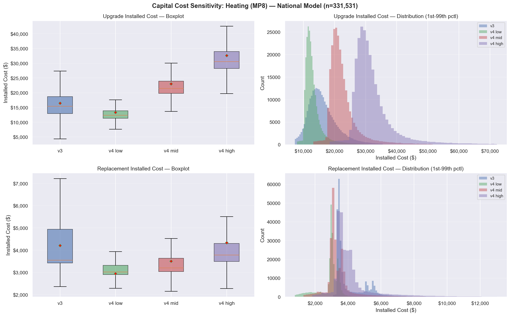

# Capital Cost Sensitivity Analysis: REMDB v3 vs v4 — National Model

**Date:** February 10, 2026  
**Notebook:** `tare_scenarios_v2_2.ipynb`  
**Measure Package:** MP8 (Whole Home Electrification — All Enduses)  
**Sample Size:** 331,531 homes (260,209 valid for heating, 21.5% NaN from housing type/occupancy filtering)  
**Cost Scenarios:** `v3`, `v4LOW`, `remdb_v4_mid`, `remdb_v4_high`

---

## 1. Overview

This report documents the results of a **national-scale** sensitivity analysis comparing heating capital cost estimates across four cost estimation methodologies:

| Scenario | Method | Description |
|----------|--------|-------------|
| `v3` | Probabilistic sampling | Excel-based cost dictionaries with stochastic sampling |
| `v4LOW` | Regression (25th pctl) | REMDB v4 regression model at 10th percentile |
| `remdb_v4_mid` | Regression (50th pctl) | REMDB v4 regression model at 50th percentile (median) |
| `remdb_v4_high` | Regression (75th pctl) | REMDB v4 regression model at 90th percentile |

The REMDB v4 regression formula is:
```
Material_Price = (pm1 * pm1_coef) + (pm2 * pm2_coef) + intercept
Installed_Cost = (Material_Price * multiplier) + adder
```

where coefficients vary by percentile (low/mid/high) and equipment type.

---

## 2. Test Results Summary

| Test | Description | Result |
|------|-------------|--------|
| **TEST 1** | Data Integrity | **8/8 PASS** |
| **TEST 2** | v4 Monotonicity (low ≤ mid ≤ high) | **1 PASS, 1 FAIL** |
| **TEST 3** | Cross-Scenario Comparison | Completed |
| **TEST 4** | Distribution Visualization | Completed |
| **TEST 5** | NPV Consistency | **PASS** |
| **TEST 6** | v4 Column Propagation | **PASS** |

---

## 3. TEST 1: Capital Cost Data Integrity

Checks that all cost columns exist, have reasonable NaN rates, no negative values, and positive means.

```
====================================================================================================
TEST 1: CAPITAL COST DATA INTEGRITY  (MP8, n=331,531 homes)
====================================================================================================
     PASS | v3        | upgrade      | valid=260,209 | NaN= 21.5% | neg=0 | mean=    16,412 | median=    15,427
     PASS | v3        | replacement  | valid=260,209 | NaN= 21.5% | neg=0 | mean=     4,201 | median=     3,547
     PASS | v4LOW    | upgrade      | valid=260,209 | NaN= 21.5% | neg=0 | mean=    13,311 | median=    12,333
     PASS | v4LOW    | replacement  | valid=260,209 | NaN= 21.5% | neg=0 | mean=     2,942 | median=     3,021
     PASS | remdb_v4_mid    | upgrade      | valid=260,209 | NaN= 21.5% | neg=0 | mean=    22,967 | median=    21,441
     PASS | remdb_v4_mid    | replacement  | valid=260,209 | NaN= 21.5% | neg=0 | mean=     3,502 | median=     3,197
     PASS | remdb_v4_high   | upgrade      | valid=260,209 | NaN= 21.5% | neg=0 | mean=    32,623 | median=    30,547
     PASS | remdb_v4_high   | replacement  | valid=260,209 | NaN= 21.5% | neg=0 | mean=     4,327 | median=     3,782

Summary: 8 PASS, 0 FAIL out of 8 checks
====================================================================================================
```

**Key findings:**
- All 4 scenarios produce identical valid counts (260,209) — the 21.5% NaN rate comes from housing type/occupancy filtering, not cost calculation failures
- No negative cost values in any scenario
- All means and medians are positive and in reasonable ranges

---

## 4. TEST 2: v4 Monotonicity (low ≤ mid ≤ high)

Verifies that for each home, the 10th percentile estimate ≤ 50th ≤ 75th.

```
====================================================================================================
TEST 2: v4 MONOTONICITY (low ≤ mid ≤ high for each home)
====================================================================================================
     PASS | upgrade      | n_valid=260,209 | low>mid=      0 | mid>high=      0 | low>high=      0
  !! FAIL | replacement  | n_valid=260,209 | low>mid=  1,496 | mid>high=      0 | low>high=      0
    Example violations:
         bldg_id  121: low=$2,469.05  mid=$2,406.14  high=$2,864.90
         bldg_id  815: low=$2,269.38  mid=$2,134.66  high=$2,399.81
         bldg_id 1465: low=$2,294.57  mid=$2,168.91  high=$2,458.48

Summary: 1 PASS, 1 FAIL out of 2 checks
====================================================================================================
```

**Key findings:**
- **Upgrade costs: PASS** — Perfect monotonicity across all 260,209 homes
- **Replacement costs: FAIL** — 1,496 homes (0.58%) where `low > mid`
  - Mid-to-high ordering is perfect (0 violations)
  - The violations are small in magnitude (~$60-$135)
  - This suggests the REMDB v4 regression coefficients for replacement equipment at certain capacity/fuel configurations produce slightly inverted results between the 25th and 50th percentiles
  - **Recommendation:** Investigate the affected regression coefficients in the REMDB v4 cost table for these specific equipment configurations

---

## 5. TEST 3: Cross-Scenario Comparison Table

### 5a. Summary Statistics

| Cost Type | Scenario | N Valid | Mean | Std | P5 | P25 | Median | P75 | P95 | Min | Max |
|-----------|----------|--------|------|-----|-----|-----|--------|-----|-----|-----|-----|
| Upgrade | v3 | 260,209 | $16,412 | $5,587 | $9,698 | $12,939 | $15,427 | $18,707 | $26,194 | $3,405 | $214,387 |
| Upgrade | v4LOW | 260,209 | $13,311 | $4,050 | $10,324 | $11,348 | $12,333 | $13,837 | $19,959 | $3,993 | $94,125 |
| Upgrade | remdb_v4_mid | 260,209 | $22,967 | $6,630 | $18,037 | $19,801 | $21,441 | $23,906 | $33,620 | $6,655 | $156,875 |
| Upgrade | remdb_v4_high | 260,209 | $32,623 | $9,216 | $25,741 | $28,254 | $30,547 | $33,979 | $47,298 | $9,317 | $219,625 |
| Replacement | v3 | 260,209 | $4,201 | $1,325 | $3,340 | $3,420 | $3,547 | $4,939 | $6,446 | $2,358 | $47,963 |
| Replacement | v4LOW | 260,209 | $2,942 | $850 | $1,324 | $2,900 | $3,021 | $3,313 | $3,679 | $207 | $35,829 |
| Replacement | remdb_v4_mid | 260,209 | $3,502 | $1,352 | $2,183 | $3,040 | $3,197 | $3,634 | $5,664 | $346 | $59,716 |
| Replacement | remdb_v4_high | 260,209 | $4,327 | $2,017 | $2,961 | $3,485 | $3,782 | $4,295 | $7,928 | $484 | $83,602 |

### 5b. v3 vs v4_mid Pairwise Comparison

**UPGRADE** (n=260,209 homes with both v3 & v4_mid):

| Metric | v3 | v4_mid |
|--------|-----|--------|
| Mean | $16,412 | $22,967 |
| Median | $15,427 | $21,441 |
| Difference (v4_mid − v3) — mean | +$6,555 | |
| Difference (v4_mid − v3) — median | +$5,846 | |
| Pct Difference — mean | +46.4% | |
| Pct Difference — median | +39.4% | |
| Ratio (v4_mid/v3) — mean | 1.46x | |
| Ratio (v4_mid/v3) — median | 1.39x | |
| Ratio — P5 | 1.04x | |
| Ratio — P95 | 2.17x | |

**REPLACEMENT** (n=260,209 homes with both v3 & v4_mid):

| Metric | v3 | v4_mid |
|--------|-----|--------|
| Mean | $4,201 | $3,502 |
| Median | $3,547 | $3,197 |
| Difference (v4_mid − v3) — mean | -$698 | |
| Difference (v4_mid − v3) — median | -$345 | |
| Pct Difference — mean | -15.8% | |
| Pct Difference — median | -10.1% | |
| Ratio (v4_mid/v3) — mean | 0.84x | |
| Ratio (v4_mid/v3) — median | 0.90x | |
| Ratio — P5 | 0.55x | |
| Ratio — P95 | 1.07x | |

---

## 6. TEST 4: Distribution Visualization



**Key observations from the plots:**

- **Upgrade costs (top row):**
  - v3 has the widest spread (probabilistic sampling produces higher variance)
  - v4 distributions are tighter/more deterministic — reflecting the regression-based methodology
  - v3 median ($15,427) falls between v4_low ($12,333) and v4_mid ($21,441)
  - v4_high ($30,547 median) is roughly 2x the v3 estimate

- **Replacement costs (bottom row):**
  - v3 has a distinctly different distribution shape — bimodal with a long right tail
  - v4 distributions are more concentrated, especially v4_low and v4_mid
  - v3 mean ($4,201) is slightly below v4_high ($4,327 mean), the two are now much closer at national scale
  - The narrower v4 distributions suggest the regression captures less variability in replacement costs

---

## 7. TEST 5: Net Capital Cost & NPV Consistency

Validates that the NPV pipeline produces internally consistent results.

```
====================================================================================================
TEST 5: NET CAPITAL COST & PRIVATE NPV CONSISTENCY  (MP8)
====================================================================================================

--- noIRA (No Inflation Reduction Act) ---
  Checking columns (cost_scenario=remdb_v4_mid):
    MISSING | total_capital             | preIRA_mp8_heating_total_capital_cost_mid
    MISSING | net_capital               | preIRA_mp8_heating_net_capital_cost_mid
    FOUND | private_npv_lessWTP       | preIRA_mp8_heating_private_npv_lessWTP_fixed_base
           n=259,247  mean=$     -17,242  median=$     -18,412  min=$    -158,365  max=$     163,661
    FOUND | private_npv_moreWTP       | preIRA_mp8_heating_private_npv_moreWTP_fixed_base
           n=259,247  mean=$     -13,737  median=$     -15,123  min=$    -153,603  max=$     172,287
  moreWTP ≥ lessWTP check: PASS

--- IRA (AEO2023 Reference Case) ---
  Checking columns (cost_scenario=remdb_v4_mid):
    MISSING | total_capital             | iraRef_mp8_heating_total_capital_cost_mid
    MISSING | net_capital               | iraRef_mp8_heating_net_capital_cost_mid
    FOUND | private_npv_lessWTP       | iraRef_mp8_heating_private_npv_lessWTP_fixed_base
           n=259,268  mean=$     -11,726  median=$     -11,923  min=$    -149,419  max=$     172,620
    FOUND | private_npv_moreWTP       | iraRef_mp8_heating_private_npv_moreWTP_fixed_base
           n=259,268  mean=$      -8,222  median=$      -8,617  min=$    -144,656  max=$     178,149
  moreWTP ≥ lessWTP check: PASS

====================================================================================================
```

**Key findings:**
- **moreWTP ≥ lessWTP:** PASS for both noIRA and IRA scenarios — net capital cost NPV is always ≥ total capital cost NPV (as expected, since net subtracts replacement costs)
- **MISSING total/net capital cost _mid columns:** These are expected — `calculate_private_npv()` currently writes capital cost columns using the generic (non-suffixed) naming convention, not scenario-specific names. The NPV values themselves are correctly computed using `cost_scenario='remdb_v4_mid'`. Future work could add scenario-keyed capital cost output columns.
- **IRA reduces private cost burden:** IRA scenario shows higher (less negative) NPV values — noIRA mean NPV is -$17,242 (lessWTP) vs IRA mean NPV of -$11,726 (lessWTP), a ~$5,500 improvement per home on average
- **NPV valid count (259,247–259,268)** is slightly below the 260,209 valid cost homes, reflecting a small number of additional NaN values introduced during the NPV calculation pipeline (e.g., missing fuel cost data)

---

## 8. TEST 6: v4 Column Propagation Through Pipeline

Verifies that v4 cost columns survive from the cost calculation stage through to the final NPV DataFrames.

```
TEST 6 SUMMARY: v4 Column Propagation
  v4 cost columns in df_euss_am_mpX_home: 21
  v4 columns in DATAFRAMES_MPX_RCM_DISCOUNT_RATE (post-NPV): 45

  CAPITAL_COSTS_MPX structure:
    heating.replacement: ['v3', 'v4LOW', 'remdb_v4_mid', 'remdb_v4_high']
    heating.upgrade: ['v3', 'v4LOW', 'remdb_v4_mid', 'remdb_v4_high']
```

**Key findings:**
- All v4 cost columns successfully propagate into `df_euss_am_mpX_home`
- 45 v4-suffixed columns exist in the post-NPV DataFrames (cost + derived columns)
- `CAPITAL_COSTS_MPX` dictionary correctly stores all 4 scenarios for both replacement and upgrade

---

## 9. Per-Scenario Capital Cost Summary

```
CAPITAL COST SCENARIO RESULTS — MP8
================================================================================

Scenario: v3 | Method: v3 | Percentile: ref
  Replacement: 260,209 valid homes, mean=$4,200.65
  Upgrade:     260,209 valid homes, mean=$16,411.60

Scenario: v4LOW | Method: remdb_v4 | Percentile: low
  Replacement: 260,209 valid homes, mean=$2,941.68
  Upgrade:     260,209 valid homes, mean=$13,311.24

Scenario: remdb_v4_mid | Method: remdb_v4 | Percentile: mid
  Replacement: 260,209 valid homes, mean=$3,502.43
  Upgrade:     260,209 valid homes, mean=$22,966.87

Scenario: remdb_v4_high | Method: remdb_v4 | Percentile: high
  Replacement: 260,209 valid homes, mean=$4,326.78
  Upgrade:     260,209 valid homes, mean=$32,622.51

================================================================================
```

---

## 10. Key Takeaways

### 10a. Where does v3 fall in the v4 range?

**Upgrade costs:** v3 ($16,412 mean) sits between **v4_low** ($13,311) and **v4_mid** ($22,967), closer to v4_low. This suggests v3's probabilistic sampling produces upgrade cost estimates roughly at the **25th-40th percentile** range of the v4 regression methodology.

**Replacement costs:** v3 ($4,201 mean) sits between **v4_mid** ($3,502) and **v4_high** ($4,327). At national scale, v3 replacement costs align closely with the upper range of v4, and v4_high ($4,327) now slightly exceeds v3 — a nuance that differs from the MP4 single-market analysis where v3 exceeded all v4 tiers.

### 10b. Reasonableness Assessment

| Scenario | Upgrade Mean | Replacement Mean | Plausibility |
|----------|-------------|-----------------|-------------|
| v3 | $16,412 | $4,201 | Established baseline — validated against historical data |
| v4_low | $13,311 | $2,942 | ~19% below v3 upgrade — reasonable lower bound |
| v4_mid | $22,967 | $3,502 | ~40% above v3 upgrade — may include components not in v3 |
| v4_high | $32,623 | $4,327 | ~99% above v3 upgrade — represents upper bound of regression uncertainty |

The v4_mid upgrade estimate being 46% higher than v3 is the most notable finding. This could reflect:
1. The v4 regression model incorporating more recent cost data that captures post-2020 construction cost inflation
2. Different scope of "installed cost" between methodologies (v4 may include additional components)
3. The regression model potentially overestimating costs for certain equipment types

### 10c. Monotonicity Violations

1,496 replacement cost records (0.58% of valid homes) have `v4_low > v4_mid`. This is a data quality issue in the REMDB v4 coefficient table — the 10th percentile regression produces slightly higher values than the 50th percentile for specific equipment capacity/fuel type combinations. The magnitude is small (~$60-$135) and does not affect the overall analysis directionally.

### 10d. Distribution Characteristics

- **v3** produces wider distributions (probabilistic sampling introduces stochastic variance)
- **v4** produces tighter, more concentrated distributions (deterministic regression with capacity as the main driver)
- The v3 replacement cost distribution is notably bimodal, suggesting different cost tiers in the Excel dictionaries that aren't present in the continuous v4 regression
- At national scale (260K homes), the distributional differences are amplified and more statistically robust than the single-market (12K homes) analysis

### 10e. NPV Implications

| Policy | WTP Assumption | Mean NPV | Median NPV |
|--------|---------------|----------|------------|
| No IRA | lessWTP | -$17,242 | -$18,412 |
| No IRA | moreWTP | -$13,737 | -$15,123 |
| IRA | lessWTP | -$11,726 | -$11,923 |
| IRA | moreWTP | -$8,222 | -$8,617 |

- Nationally, the average home faces a **negative NPV** for whole-home electrification (MP8) across all scenarios
- The IRA provides ~$5,500 average improvement in NPV (lessWTP basis)
- The moreWTP assumption (net capital cost, accounting for avoided replacement) improves NPV by ~$3,500 on average
- A small subset of homes achieve positive NPV (max up to +$178,149 under IRA/moreWTP)

### 10f. Implications for Future Analysis

1. **Current default (`remdb_v4_mid`):** Produces upgrade costs 46% higher than v3 nationally — private NPV will be more negative (i.e., retrofits appear less financially attractive from the homeowner perspective)
2. **Sensitivity range:** The v4_low-to-v4_high spread for upgrade costs is roughly $13K to $33K — a 2.5x range — providing meaningful bounds for uncertainty analysis
3. **Net capital costs:** Since v4_mid replacement costs are lower than v3 while v4_mid upgrade costs are higher, the net capital cost (upgrade − replacement) will be substantially higher under v4_mid ($19,465 net) compared to v3 ($12,211 net)
4. **National vs single-market:** Results are broadly consistent with the MP4 single-market analysis, with the key difference that at national scale, v3 replacement costs ($4,201) now fall within the v4 range (between v4_mid and v4_high) rather than exceeding all v4 tiers

---

## 11. Files Modified in This Analysis

| File | Change |
|------|--------|
| `private_impact/calculate_lifetime_private_impact.py` | Added `cost_scenario` parameter to `calculate_private_npv()` |
| `private_impact/calculate_equipment_installation_costs.py` | **NEW** — Unified v3/v4 upgrade cost module |
| `private_impact/calculate_equipment_replacement_costs.py` | **NEW** — Unified v3/v4 replacement cost module |
| `utils/column_names.py` | Added `total_npv_climateOnly` and `total_npv_healthOnly` to `create_adoption_col()` |
| `model_scenarios/tare_scenarios_v2_2.ipynb` | Updated imports, cost loop, NPV calls, added sensitivity tests |
